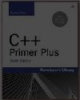
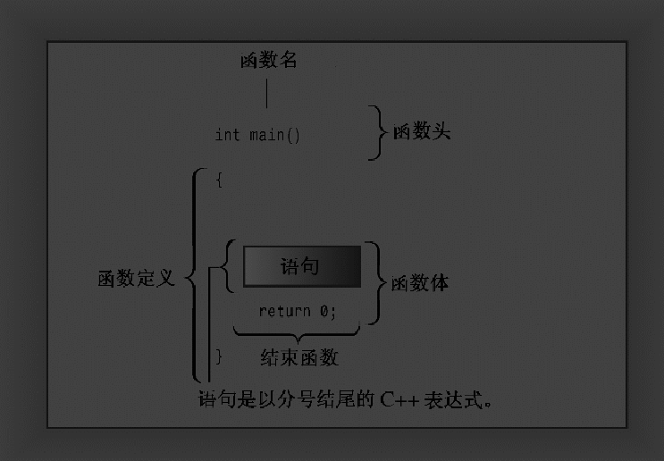
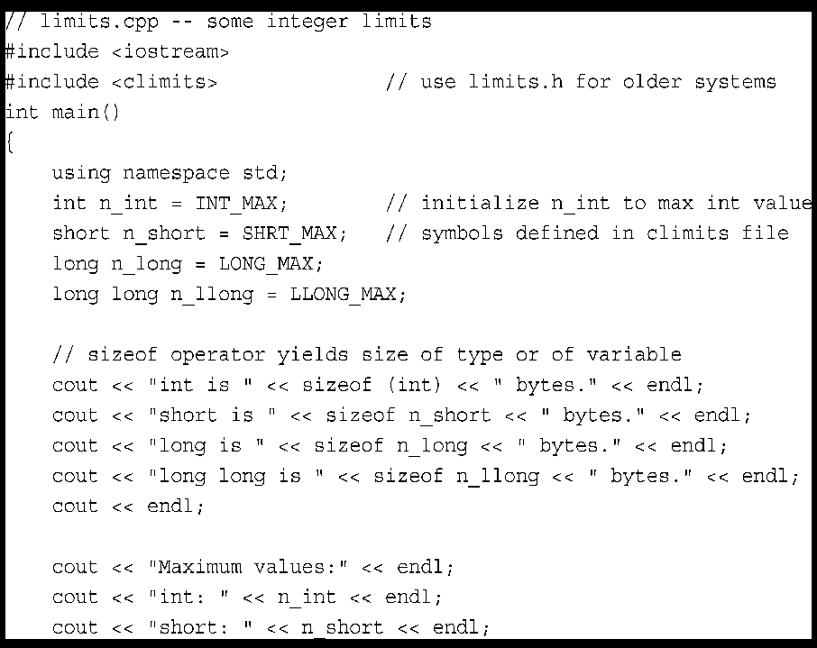
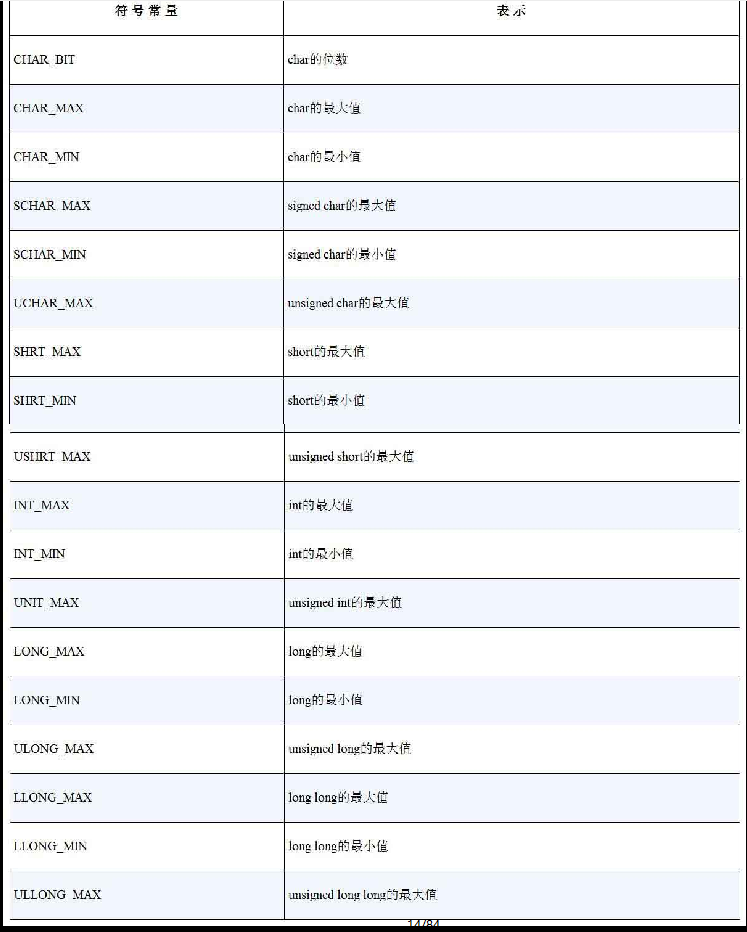
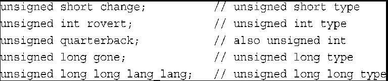
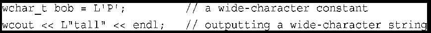
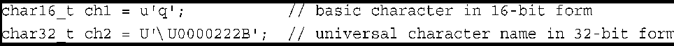
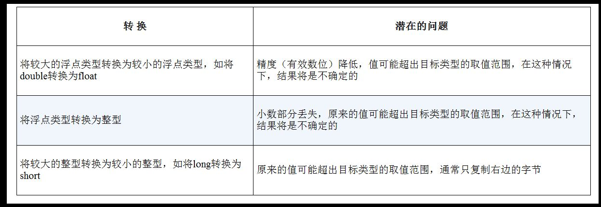
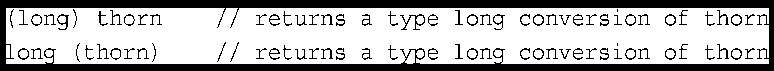
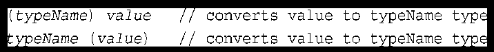

# C++  Primer Plus




## 1 预备知识

面对过程编程  自顶向下（top-down）

面对对象编程（OOP） 自下向上 （bottom-up）


## 2 Start C++


### 2.1 进入C++


**示例：**

```c++
#include <iostream>

int main()
{   
    using namespace std;
    cout << "Hello World!\n";
    return 0;
}
```

+ 注释， 由前缀//标识

+ 预处理器编译指令#include

+ 函数头 int main()

+ 编译指令 using namespace

+ 函数体， 用 {和}括起

+ 使用c++的cout 工具显示消息的语句

+ 结束main()函数的return 语句

  


### 2.2 C++语句

#### 2.2.1声明语句和变量

```c++
int carrots;
//int 声明需要的内存
//carrots 声明内存单元的名称

```

#### 2.2.2 赋值语句

```c++
int steinway;
int baldwin;
int yamaha;
yamaha = baldwin = steinway = 88;
steinway = 1;
```


## 3  处理数据


### 3.1 简单变量


#### 3.1.1 变量名

+ 在名称中只能使用字母字符、数字和下划线（_）。
+ 名称的第一个字符不能是数字。
+ 区分大写字符与小写字符。
+ 不能将C++关键字用作名称。
+ 以两个下划线或下划线和大写字母打头的名称被保留给实现（编译器及其使用的资源）使用。以一个下划线开头的名称被保留给实现，用作全局标识符。
+ C++对于名称的长度没有限制，名称中所有的字符都有意义，但有些平台有长度限制。

#### 3.1.2 整型

整数就是没有小数部分的数字，如2、98、-5286和0。整数有很多，如果将无限大的整数看作很大，则不可能用有限的计算机内存来表示所有的整数。因此，语言只能表示所有整数的一个子集。有些语言只提供一种整型（一种类型满足所有要求！），而C++则提供好几种，这样便能够根据程序的具体要求选择最合适的整型。
不同C++整型使用不同的内存量来存储整数。使用的内存量越大，可以表示的整数值范围也越大。另外，有的类型（符号类型）可表示正值和负值，而有的类型（无符号类型）不能表示负值。术语宽度（width）用于描述存储整数时使用的内存量。使用的内存越多，则越宽。C++的基本整型（按宽度递增的顺序排列）分别是==char、short、int、long和C++11新增的long long==，其中每种类型都有符号版本和无符号版本，因此总共有10种类型可供选择。下面更详细地介绍这些整数类型。由于char类型有一些特殊属性（它最常用来表示字符，而不是数字），因此本章将首先介绍其他类型。

 

#### 3.1.3 整型short、int、long和long long

计算机内存由一些叫做位（bit）的单元组成。C++的short、int、long和long long类型通过使用不同数目的位来存储值，最多能够表示4种不同的整数宽度。如果在所有的系统中，每种类型的宽度都相同，则使用起来将非常方便。例如，如果short总是16位，int总是32位，等等。不过生活并非那么简单，没有一种选择能够满足所有的计算机设计要求。C++提供了一种灵活的标准，它确保了最小长度（从C语言借鉴而来）

==short至少16位；
int至少与short一样长；
long至少32位，且至少与int一样长；
long long至少64位，且至少与long一样长。==


计算机内存的基本单元是==位（bit）==。可以将位看作电子开关，可以开，也可以关。关表示值0，开表示值1。8位的内存块可以设置出256种不同的组合，因为每一位都可以有两种设置，所以8位的总组合数为2×2×2×2×2×2×2×2，即256。因此，8位单元可以表示0-255或者-128到127。每增加一位，组合数便加倍。这意味着可以把16位单元设置成65 536个不同的值，把32位单元设置成4 294 672 296个不同的值，把64位单元设置为18 446 744 073 709 551 616个不同的值。作为比较，unsigned long存储不了地球上当前的人数和银河系的星星数，而long long能够。
==字节（byte）==通常指的是8位的内存单元。从这个意义上说，字节指的就是描述计算机内存量的度量单位，1KB等于1024字节，1MB等于1024KB。然而，C++对字节的定义与此不同。C++字节由至少能够容纳实现的基本字符集的相邻位组成，也就是说，可能取值的数目必须等于或超过字符数目。在美国，基本字符集通常是ASCII和EBCDIC字符集，它们都可以用8位来容纳，所以在使用这两种字符集的系统中，C++字节通常包含8位。然而，国际编程可能需要使用更大的字符集，如Unicode，因此有些实现可能使用16位甚至32位的字节。有些人使用术语八位组（octet）表示8位字节。

当前很多系统都使用最小长度，即short为16位，long为32位。这仍然为int提供了多种选择，其宽度可以是16位、24位或32位，同时又符合标准；甚至可以是64位，因为long和long long至少长64位。通常，在老式IBM PC的实现中，int的宽度为16位（与short相同），而在Windows XP、Windows Vista、Windows 7、Macintosh OS X、VAX和很多其他微型计算机的实现中，为32位（与long相同）。有些实现允许选择如何处理int。（读者所用的实现使用的是什么？下面的例子将演示如何在不打开手册的情况下，确定系统的限制。）类型的宽度随实现而异，这可能在将C++程序从一种环境移到另一种环境（包括在同一个系统中使用不同编译器）时引发问题。但只要小心一点），就可以最大限度地减少这种问题。


这4种类型（int、short、long和long long）都是符号类型，这意味着每种类型的取值范围中，负值和正值几乎相同。例如，16位的int的取值范围为-32768到+32767。
要知道系统中整数的最大长度，可以在程序中使用C++工具来检查类型的长度。首先，==sizeof运算符返回类型或变量的长度==，单位为字节（运算符是内置的语言元素，对一个或多个数据进行运算，并生成一个值。例如，加号运算符+将两个值相加）。前面说过，“字节”的含义依赖于实现，因此在一个系统中，两字节的int可能是16位，而在另一个系统中可能是32位。其次，头文件climits（在老式实现中为limits.h）中包含了关于整型限制的信息。具体地说，它定义了表示各种限制的符号名称。例如，==INT_MAX为int的最大取值，CHAR_BIT为字节的位数==。程序清单3.1演示了如何使用这些工具。该程序还演示如何初始化，即使用声明语句将值赋给变量。







**初始化**

```c++
int n_int = INT_MAX;
int uncles = 5; 
int hamburgers = {24};
int emmus{7};
int rocs = {}  //初始化为零
```


#### 3.1.4 无符号类型




#### 3.1.5 选择整型类型
C++提供了大量的整型，应使用哪种类型呢？通常，int被设置为对目标计算机而言最为“自然”的长度。自然长度（natural size）指的是计算机处理起来效率最高的长度。如果没有非常有说服力的理由来选择其他类型，则应使用int。
现在来看看可能使用其他类型的原因。如果变量表示的值不可能为负，如文档中的字数，则可以使用无符号类型，这样变量可以表示更大的值。
如果知道变量可能表示的整数值大于16位整数的最大可能值，则使用long。即使系统上int为32位，也应这样做。这样，将程序移植到16位系统时，就不会突然无法正常工作。如果要存储的值超过20亿，可使用long long。

#### 3.1.6 整型字面值
整型字面值（常量）是显式地书写的常量，如212或1776。与C相同，C++能够以三种不同的计数方式来书写整数：基数为10、基数为8（老式UNIX版本）和基数为16（硬件黑客的最爱）。附录A介绍了这几种计数系统；这里将介绍C++表示法。C++使用前一（两）位来标识数字常量的基数。如果第一位为1～9，则基数为10（十进制）；因此93是以10为基数的。如果第一位是0，第二位为1～7，则基数为8（八进制）；因此042的基数是8，它相当于十进制数34。如果前两位为0x或0X，则基数为16（十六进制）；因此0x42为十六进制数，相当于十进制数66。对于十六进制数，字符a～f和A～F表示了十六进制位，对应于10～15。0xF为15，0xA5为165（10个16加5个1）。程序清单3.3演示了这三种基数。


#### 3.1.8 char   signed char  unsigned char  wchar_t  char16_t  char32_t







#### 3.1.9 bool类型
ANSI/ISO C++标准添加了一种名叫bool的新类型（对C++来说是新的）。它的名称来源于英国数学家George Boole，是他开发了逻辑律的数学表示法。在计算中，布尔变量的值可以是true或false。过去，C++和C一样，也没有布尔类型。在第5章和第6章中将会看到，C++将非零值解释为true，将零解释为false。然而，现在可以使用bool类型来表示真和假了，它们分别用预定义的字面值true和false表示。

### 3.2 const限定符

```C++
const type_name = value;
```


### 3.3 浮点数

C++也有3种浮点类型：float、double和long double

C++对于有效位数的要求是，float至少32位，double至少48位，且不少于float，long double至少和double一样多。这三种类型的有效位数可以一样多。然而，通常，float为32位，double为64位，long double为80、96或128位。另外，这3种类型的指数范围至少是−37到37。可以从头文件cfloat或float.h中找到系统的限制


### 3.4 C++ 算数运算符


下面是5种基本的C++算术运算符。

+ +运算符对操作数执行加法运算。例如，4+20等于24。
+ −运算符从第一个数中减去第二个数。例如，12−3等于9。
+ *运算符将操作数相乘。例如，28\*4等于112。
+ /运算符用第一个数除以第二个数。例如，1000/5等于200。==如果两个操作数都是整数，则结果为商的整数部分。例如，17/3等于5，小数部分被丢弃。==
+ %运算符求模。也就是说，它生成第一个数除以第二个数后的余数。例如，19%6为1，因为19是6的3倍余1。两个操作数必须都是整型，将该运算符用于浮点数将导致编译错误。如果其中一个是负数，则结果的符号满足如下规则：(a/b)*b + a%b ＝ a。


#### 3.4.4 类型转换

C++丰富的类型允许根据需求选择不同的类型，这也使计算机的操作更复杂。例如，将两个short值相加涉及到的硬件编译指令可能会与将两个long值相加不同。由于有11种整型和3种浮点类型，因此计算机需要处理大量不同的情况，尤其是对不同的类型进行运算时。为处理这种潜在的混乱，C++自动执行很多类型转换：

+ 将一种算术类型的值赋给另一种算术类型的变量时，C++将对值进行转换；
+ 表达式中包含不同的类型时，C++将对值进行转换；
+ 将参数传递给函数时，C++将对值进行转换。



C++11将使用大括号的初始化称为列表初始化（list-initialization），因为这种初始化常用于给复杂的数据类型提供值列表。

列表初始化不允许缩窄（narrowing），即变量的类型可能无法表示赋给它的值。例如，不允许将浮点型转换为整型。在不同的整型之间转换或将整型转换为浮点型可能被允许，条件是编译器知道目标变量能够正确地存储赋给它的值。例如，可将long变量初始化为int值，因为long总是至少与int一样长；相反方向的转换也可能被允许，只要int变量能够存储赋给它的long常量：







## 命名规则


#### 变量

#### 常量

#### 全局变量

#### 静态变量

#### 成员变量

#### 函数

#### 类


