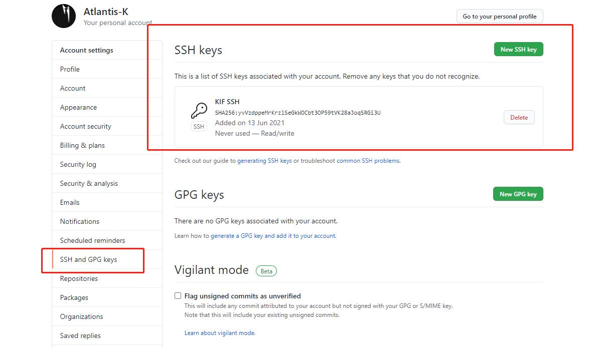

# Git

## 使用流程

+ 在目标文件夹打开git
+ ssh-keygen -t rsa -C "mengfansong_kif@outlook.com"
+ C:\Users\KIF\.ssh  

+ ssh -T git@github.com  yes
+ git config --global user.email "mengfansong_kif@outlook.com"
+ git config --global user.name "KIF"
+ git init
+ git add --all
+ git status
+ git commit -m "git test"
+ 

